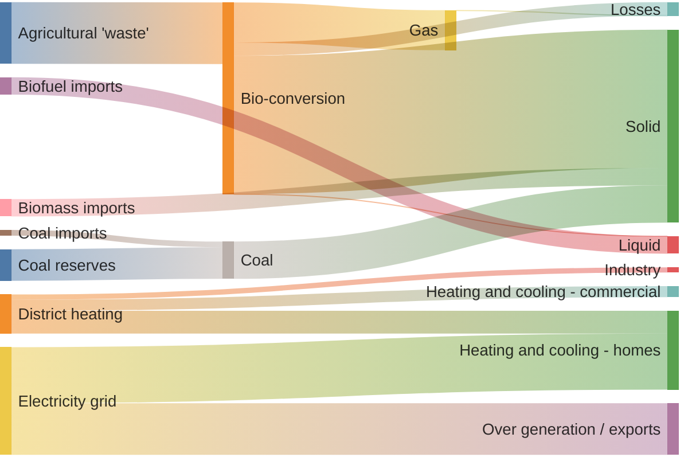
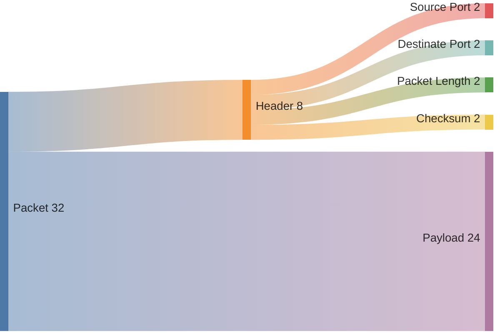

# Preview Light in Dark

This is an opinionated markdown preview style for VS Code.

I like dark theme with VS Code and also use **Mermaid** to draw figures. I found there's no any dark theme could properly render ****Mermaid**** figures. You can't identify some elements because the dark background eats them.

Then I tried [Markdown Preview Github Styling](https://github.com/mjbvz/vscode-github-markdown-preview-style), with it you can render markdown with light style even your VS Code is dark theme. However, there's one critical design I can't accept: the maximum width the preview page is limited to 960px(or so). Sometimes you will draw big figures, 960px is obviously not enough to view them. I posted an issue to the author of the extension but be replied that the limitation will not change as github is just 960px.

Luckily VS Code supports markdown preview customization, so I created this style file for personal customization.

## How to Use?

1. Create `Style.css` file in root folder.
2. Create `.VS Code`  folder in root folder if you don't have it. 
3. Create `setting.json` file in `.VS Code` if you don't have it.
4. Paste below content to `setting.json`:

```json
"markdown.styles": [
  "Style.css"
]
```
> Of course you need to install [Makrdown Preview Mermaid Support](https://github.com/mjbvz/vscode-markdown-mermaid.git) to preview mermaid.
> 
>  I assume you are using dark theme for VS Code, you remember to change `Dark Mode Theme` option to `default` (not the default `dark`)to get better render result.

## Examples

> You may see some error rendering in github page, that's expected as it doesn't support latest mermaid version.
>
> Try to clone the repo and preview it in your locally VS Code.




